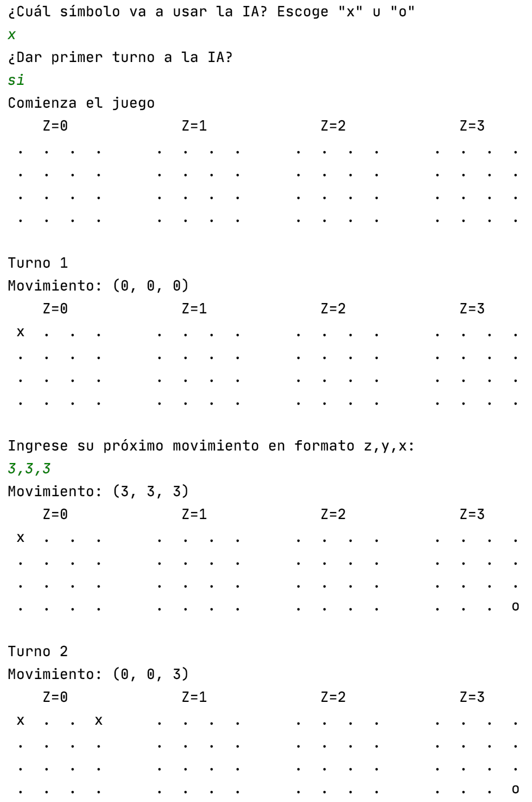

# 3D Tic Tac Toe

A 3D version of the classic TicTacToe game where the board a Cube instead of a 2D flat board. This version is a console implementation for Player vs AI matches.

The AI implements concepts from game theory, including the MinMax algorithm and evaluation functions.
Also, I designed the game to have easily modifiable search algorithm and evaluation function, which are contained in the *AiPlayer* and *EvaluationFunction* classes.

##Screenshot
